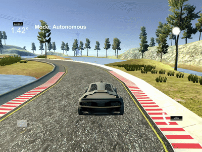
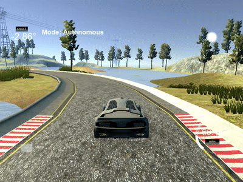

# CarND-Controls-PID
Self-Driving Car Engineer Nanodegree Program

---

## Dependencies

* cmake >= 3.5
 * All OSes: [click here for installation instructions](https://cmake.org/install/)
* make >= 4.1(mac, linux), 3.81(Windows)
  * Linux: make is installed by default on most Linux distros
  * Mac: [install Xcode command line tools to get make](https://developer.apple.com/xcode/features/)
  * Windows: [Click here for installation instructions](http://gnuwin32.sourceforge.net/packages/make.htm)
* gcc/g++ >= 5.4
  * Linux: gcc / g++ is installed by default on most Linux distros
  * Mac: same deal as make - [install Xcode command line tools]((https://developer.apple.com/xcode/features/)
  * Windows: recommend using [MinGW](http://www.mingw.org/)
* [uWebSockets](https://github.com/uWebSockets/uWebSockets)
  * Run either `./install-mac.sh` or `./install-ubuntu.sh`.
  * If you install from source, checkout to commit `e94b6e1`, i.e.
    ```
    git clone https://github.com/uWebSockets/uWebSockets
    cd uWebSockets
    git checkout e94b6e1
    ```
    Some function signatures have changed in v0.14.x. See [this PR](https://github.com/udacity/CarND-MPC-Project/pull/3) for more details.
* Simulator. You can download these from the [project intro page](https://github.com/udacity/self-driving-car-sim/releases) in the classroom.

Fellow students have put together a guide to Windows set-up for the project [here](https://s3-us-west-1.amazonaws.com/udacity-selfdrivingcar/files/Kidnapped_Vehicle_Windows_Setup.pdf) if the environment you have set up for the Sensor Fusion projects does not work for this project. There's also an experimental patch for windows in this [PR](https://github.com/udacity/CarND-PID-Control-Project/pull/3).

## Basic Build Instructions

1. Clone this repo.
2. Make a build directory: `mkdir build && cd build`
3. Compile: `cmake .. && make`
4. Run it: `./pid`.

Tips for setting up your environment can be found [here](https://classroom.udacity.com/nanodegrees/nd013/parts/40f38239-66b6-46ec-ae68-03afd8a601c8/modules/0949fca6-b379-42af-a919-ee50aa304e6a/lessons/f758c44c-5e40-4e01-93b5-1a82aa4e044f/concepts/23d376c7-0195-4276-bdf0-e02f1f3c665d)

## Editor Settings

We've purposefully kept editor configuration files out of this repo in order to
keep it as simple and environment agnostic as possible. However, we recommend
using the following settings:

* indent using spaces
* set tab width to 2 spaces (keeps the matrices in source code aligned)

## Code Style

Please (do your best to) stick to [Google's C++ style guide](https://google.github.io/styleguide/cppguide.html).

## Project Instructions and Rubric

Note: regardless of the changes you make, your project must be buildable using
cmake and make!

More information is only accessible by people who are already enrolled in Term 2
of CarND. If you are enrolled, see [the project page](https://classroom.udacity.com/nanodegrees/nd013/parts/40f38239-66b6-46ec-ae68-03afd8a601c8/modules/f1820894-8322-4bb3-81aa-b26b3c6dcbaf/lessons/e8235395-22dd-4b87-88e0-d108c5e5bbf4/concepts/6a4d8d42-6a04-4aa6-b284-1697c0fd6562)
for instructions and the project rubric.

## Reflection

### Effects of the PID Controller components

#### Proportional Controller

Using only a proportional controller, the car can not be controlled. The P controller starts to oscillate and finally
drives the car off the street.


#### Differential Controller

The differential controller is not able to keep the car within the track. The controller doesn't react quickly and
strongly enough to the changing cross track error.


#### PD Controller

The combination of the P and the D controller allows to steer the car within the track. Nevertheless there remains a
constant offset from the track center, especially in curves. In sharper curves this leads the vehicle to come too close
to the track's edge.




#### PID Controller

Adding the integral component to the controller has benefits with regards to driving in curves. The controller
steers the vehicle back to the track center, if the cross track error cummulates over time. This behaviour can't be
achieved by the PD controller.



In sharp curves the effect of the integral component is especially visible, when the controller pulls the vehicle back
to the track center, after the cross track error got to big.


However the integral component leads to 'overshooting', i.e. the controller will overcompensate the cross track error
and this leads to additional oscillation. The overall driving performance is still improved and the
vehicle is kept in the center of the track more reliable.

### Hyperparameter tuning

The P-, I- and D-coefficients were chosen by using a sort of 'manual twiddle'. For the beginning only the proportianal
component was active.

The P paramter was then tuned, so that the controller would keep the vehicle on the track as long as possible.
However the controller always started to oscillate and drove the vehicle over the track edge.
In case the P paramter was chosen to large, the controller would begin to build up the oscillation very quickly. If the
paramter was to small, the controller wouldn't be able to steer strong enough to drive the vehicle around curves.
The P component alone was not able to drive the vehicle around the track at all.

Adding the D component could improve this behavior and reduce the oscillation. However choosing the D paramter to big,
would result in even stronger oscillation and worse performace. If the parameter is chosen too small, the differential
component can't compensate the oscillation of the proportional component.
The PD controller was able to drive the vehicle around the track without crossing the edges.
The cummulated cross track error for one 'reference round' (driving one round
from the spawning point of the vehicle and then additionally to the beginning of the bridge) was 5889.

The I component could improve the result even further. With a properly tuned I paramter (too big would lead to strong
oscillation, too small wouldn't allow the I component to correct offsets effectively), the cummulated cross track error
for one reference round could be reduced to 2617.

#### Reducing overcompensation

In order to reduce the amount of overshooting, that was introduced by adding the I component, the following experiment
was performed: Whenever the cross track error changes its sign, i.e. the vehicle crosses the center of the track, the
cummulated integral cross track error is set to 0 immediately (see line 23 in PID.cpp). This should reduce the influence
of the integral component faster, after the vehicle has been steered back to the track center and thus reduce the amount
of overcompensation. This addition reduced the cummulated cross track error to 2556.

The following paramters were chosen in the end:

* Kp: 0.06
* Ki: 0.001
* Kd: 3.5

### Controling the speed

To control the speed, another PID controller was used. The target speed was set to 60 mph. The following paramters were
chosen:

* Kp: 3.0
* Ki: 0.0002
* Kd: 10.0

Not much effort was put into tuning these paramters, because the controller only needs to accelerate the vehicle at the
beginning and then does not face any disturbances.